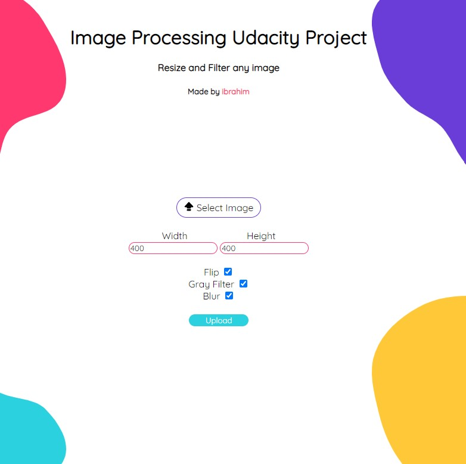

# Image proccessing Udacity Project

This project focus on creating image api using sharp 
  
Resize and filtering image using :
- Nodejs
- TypeScript
- Sharp
- Jasmine
- Express
- suppertest
- prettier
- eslint

To start the project and try the project , write in git bash :

1- git clone https://github.com/ibraKH/imageProcessing.git  
2- cd imageProcessing  
3- npm install  
4- npm start  
5- Open the browser and run at localhost port 3004  

That's it 

- localhost:3004/   : HomePage
- localhost:3004/resize/img/name=name&width=width&heigth=height  : Resize stored image
- localhost:3004/img/name=name&width=width&heigth=height   : Displaying stored img 

image file & sizes ( Width , Height ) required,
The filters are optional 

Scripts to run in the project : 
- npm start 
- npm run lint
- npm run jasmine
- npm run test
- npm run build
- npm run prettier
